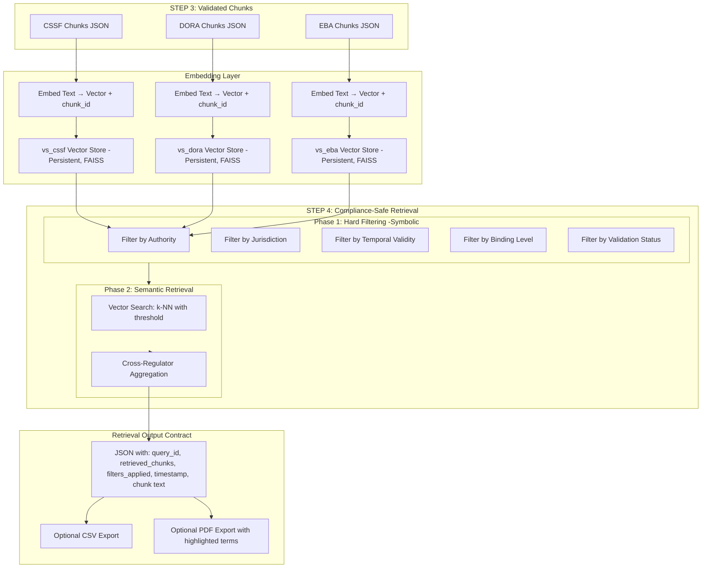

# STEP 4 — Embeddings & Retrieval

**Compliance-Safe RAG System**

**Scope:** This step establishes a controlled, auditable, and regulation-aware retrieval layer for previously validated chunks (STEP 3) from CSSF, DORA, and EBA sources.
It supports **semantic retrieval with legal fidelity**, auditability, and cross-regulator aggregation.

---

## 4.1 Objective

The objective of STEP 4 is to enable **semantic retrieval** of regulatory content while ensuring:

* **Legal fidelity**: Only approved regulatory text is retrievable.
* **Governance**: Hard filtering prevents retrieval outside scope, jurisdiction, or authority.
* **Auditability**: Each retrieval is traceable, timestamped, and reproducible.
* **Compliance safety**: Prevents hallucination and cross-regulatory contamination.
* **Operational efficiency**: Batch embedding and persistent vector stores accelerate queries; session caching reduces repeated calls.

> STEP 4 is strictly a retrieval layer; it does not interpret, summarize, or provide legal advice.

---

## 4.2 Inputs from STEP 3

**Assumptions:**

* Chunks are **validated, regulation-aware**, and frozen.
* Stored as JSON with metadata fields including:

  * `chunk_id`, `document_id`, `source_regulation`, `authority`
  * `binding_level`, `temporal_validity`, `jurisdiction`
  * `chunk_type`, `text`, `validation_status`

**Example JSON structure:**

```json
{
  "chunk_id": "CSSF_CIRC_22_806_ART_12_3",
  "source_regulation": "CSSF",
  "document_id": "CSSF_22_806",
  "article": "12(3)",
  "jurisdiction": "LU",
  "authority": "CSSF",
  "binding_level": "mandatory",
  "temporal_validity": {
    "effective_from": "2022-10-01",
    "effective_to": null
  },
  "chunk_type": "obligation",
  "text": "...",
  "validation_status": "approved"
}
```

---

## 4.3 Embedding Strategy

### 4.3.1 Data for Embeddings

* **Embed only:** `text`, `chunk_id`
* **Do not embed:** metadata, interpretations, summaries, cross-chunk references

### 4.3.2 Vector Store Segmentation

| Vector Store | Contents                     |
| ------------ | ---------------------------- |
| `vs_cssf`    | CSSF circulars & regulations |
| `vs_dora`    | DORA legal texts             |
| `vs_eba`     | EBA Guidelines / RTS / ITS   |

**Optional further segmentation:**

* Binding vs non-binding
* Level 1 vs Level 2 / 3 texts

### 4.3.3 Embedding Model Requirements

* Deterministic or version-locked for **reproducibility**
* No training on user queries for **data protection**
* Stable dimensionality for **auditability**
* EU-hostable or equivalent for **sovereignty**

### 4.3.4 Operational Enhancements

* **Batch embedding** for large chunk sets
* **Persistent vector store** via FAISS
* **Session caching** to reduce repeated embedding calls
* **Cross-regulator aggregation** for multi-source queries

---

## 4.4 Retrieval Architecture

### 4.4.1 Two-Phase Retrieval

**Phase 1 — Hard Filtering (Symbolic)**

Filters applied **before semantic search**:

* Authority (CSSF, DORA, EBA)
* Jurisdiction
* Temporal validity
* Binding level
* Validation status = approved
* Document scope

**Phase 2 — Semantic Retrieval (Vector Search)**

* Performed only on filtered chunks
* k-NN search with configurable `k` (default: 5)
* Similarity threshold enforced (configurable)
* Semantic relevance **cannot override legal applicability**
* Cross-regulator results are **merged and deduplicated**

### 4.4.2 Retrieval Output Contract

```json
{
  "query_id": "Q_2025_001",
  "retrieved_chunks": [
    {
      "chunk_id": "...",
      "source_regulation": "CSSF",
      "article": "...",
      "similarity_score": 0.83
    }
  ],
  "filters_applied": {
    "authority": "CSSF",
    "jurisdiction": "LU",
    "binding_level": "mandatory"
  },
  "retrieval_timestamp": "2025-12-30T15:00:00Z"
}
```

* Logged and persisted for **audit**
* Replayable for regulator inspection
* Includes **chunk text** for downstream citation-bound answers
* Compatible with CSV/PDF export

---

## 4.5 Compliance Controls

1. **No hallucination by design**:

   * No matching chunk → no answer
   * Mandatory citation in STEP 5

2. **Auditability & Explainability**:

   * Query → chunk traceability
   * Model version traceability
   * Re-executable for regulatory audit

3. **Separation of duties**:

   * Retrieval only
   * Reasoning / answer generation in STEP 5

4. **UI Enhancements**:

   * Highlighting of query-relevant terms (stopwords filtered)
   * CSV & PDF exports with metadata, chunk text, similarity, citation
   * Session caching for repeated queries

---

## 4.6 Out of Scope

* STEP 4 does **not** interpret regulatory content
* STEP 4 does **not** rank authority hierarchies
* STEP 4 does **not** generate legal advice

These responsibilities are reserved for **STEP 5 (Answer Construction)** with governance and human oversight.

---

## 4.7 Transition Statement

> **STEP 3 is frozen.**
> STEP 4 establishes a **compliance-safe retrieval layer**, enabling **regulated semantic access** to validated CSSF, DORA, and EBA content.
> It ensures **legal fidelity, governance, auditability, and operational efficiency** in accordance with regulatory expectations.

---

## Reference Architecture

**Figure 1 — STEP 4 Compliance-Safe Retrieval Architecture**


